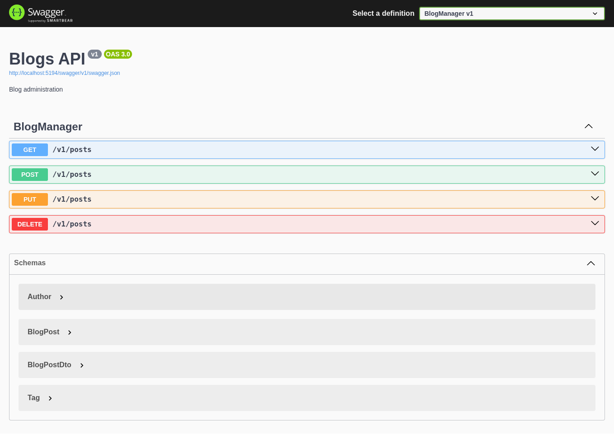

# BlogManager - Projeto ORM

API de administração de blog desenvolvida para estudos de **.NET 10** e **Entity Framework Core**.

## 🚀 Tecnologias
* .NET 10 (ASP.NET Core)
* Entity Framework Core
* SQLite (Banco de dados local)
* Swagger / OpenAPI (Documentação)

## 🛠️ Como rodar o projeto
1. Certifique-se de ter o SDK do .NET 10 instalado.
2. Clone o repositório.
3. No terminal, execute: `dotnet run`
4. Acesse: `http://localhost:5194/swagger`

