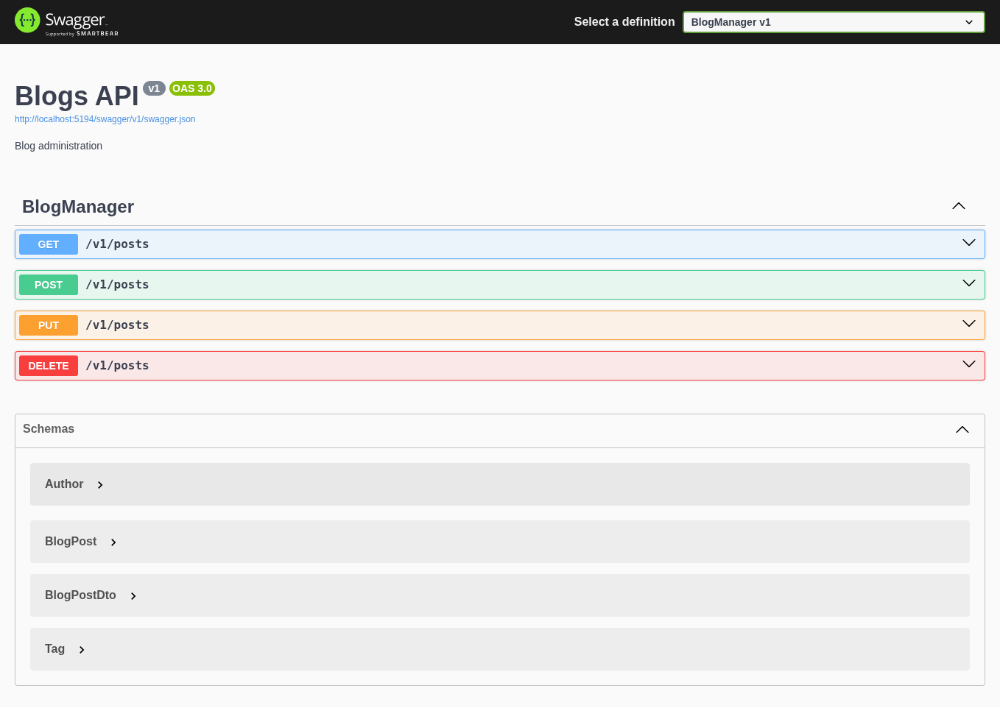

# BlogManager API


API RESTful para administração de blog, desenvolvida para estudos de **.NET 10** com **Entity Framework Core** e **SQLite**.



---

## Funcionalidades

- **CRUD completo** de posts de blog
- **Tags** associadas a posts
- **Autores** com validação de email
- **Documentação Swagger** interativa
- **Health check** endpoint para monitoramento
- **Tratamento global de exceções** com respostas padronizadas

## Tecnologias

| Tecnologia | Versão |
|---|---|
| .NET (ASP.NET Core) | 10.0 |
| Entity Framework Core | 10.0 |
| SQLite | — |
| Swashbuckle (Swagger) | 7.0 |

## Estrutura do Projeto

```
BlogManager/
├── Controllers/
│   └── PostsController.cs       # Endpoints RESTful
├── Data/
│   └── AppDbContext.cs           # Contexto do EF Core
├── Middleware/
│   └── ExceptionHandlingMiddleware.cs  # Tratamento global de erros
├── Models/
│   ├── Author.cs
│   ├── BlogPost.cs
│   ├── Tag.cs
│   └── DTOs/
│       ├── CreateBlogPostDto.cs
│       ├── UpdateBlogPostDto.cs
│       ├── BlogPostResponseDto.cs
│       └── ErrorResponseDto.cs
├── Migrations/
├── Program.cs                    # Ponto de entrada e configuração
└── appsettings.json              # Configurações da aplicação
```

## Endpoints

| Método | Rota | Descrição |
|---|---|---|
| `GET` | `/api/v1/posts` | Lista todos os posts |
| `GET` | `/api/v1/posts/{id}` | Obtém um post por ID |
| `POST` | `/api/v1/posts` | Cria um novo post |
| `PUT` | `/api/v1/posts/{id}` | Atualiza um post existente |
| `DELETE` | `/api/v1/posts/{id}` | Remove um post |
| `GET` | `/health` | Health check |

## Como Rodar

### Pré-requisitos

- [.NET 10 SDK](https://dotnet.microsoft.com/download/dotnet/10.0)

### Passos

```bash
# Clone o repositório
git clone https://github.com/RafaelBatistaDev/ORM.git
cd ORM

# Execute a aplicação
dotnet run

# Acesse o Swagger
# http://localhost:5194/swagger
```

### Migrations

Para atualizar o banco de dados manualmente:

```bash
dotnet ef database update
```

## Exemplo de Uso

### Criar um Post

```json
POST /api/v1/posts
{
  "title": "Introdução ao .NET 10",
  "content": "Neste artigo, exploramos as novidades do .NET 10...",
  "coverImage": "https://example.com/images/dotnet10.png",
  "authorId": "3fa85f64-5717-4562-b3fc-2c963f66afa6",
  "tags": [".NET", "C#", "Entity Framework"]
}
```

## Licença

Este projeto está sob a licença MIT. Veja o arquivo [LICENSE](LICENSE) para mais detalhes.
